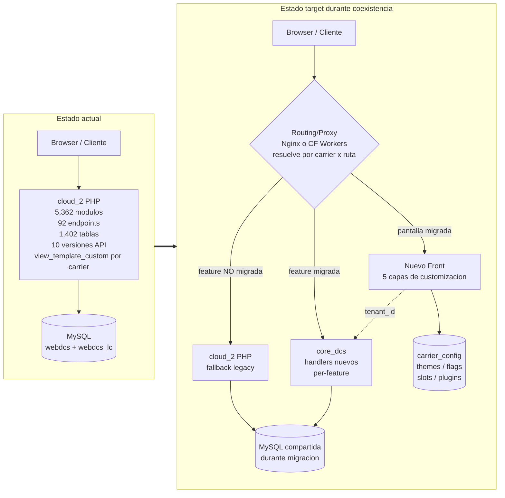
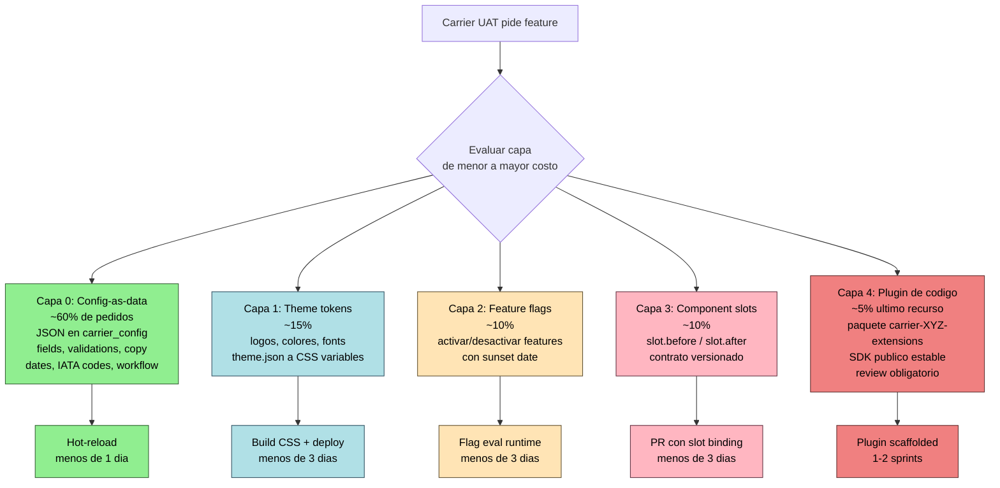
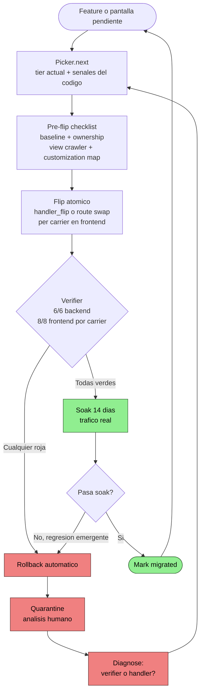
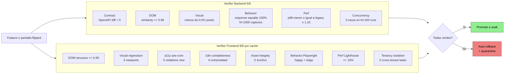
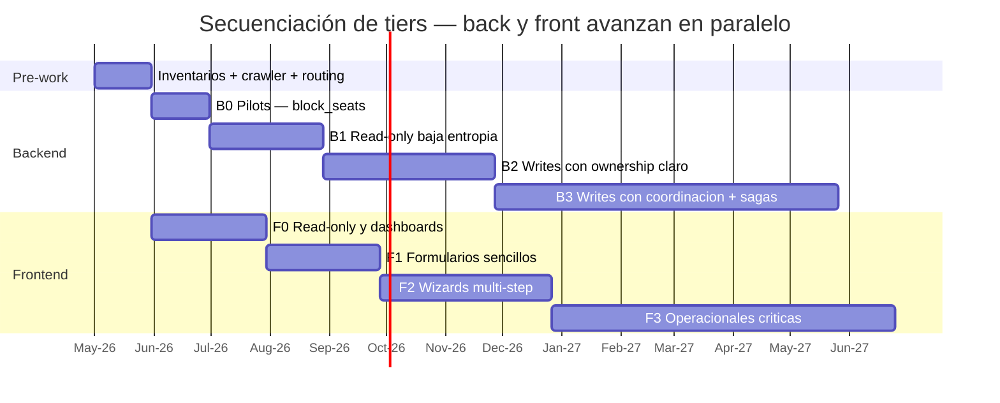
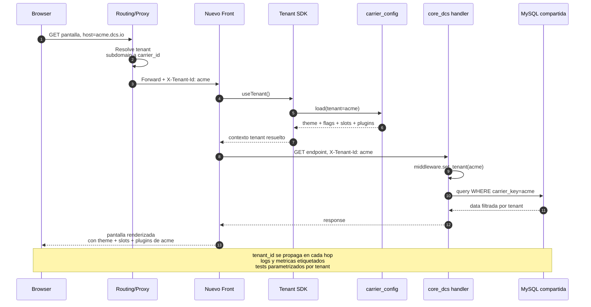
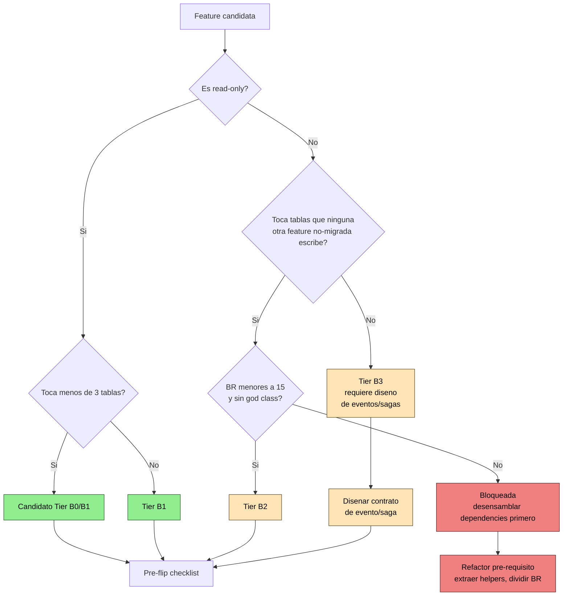
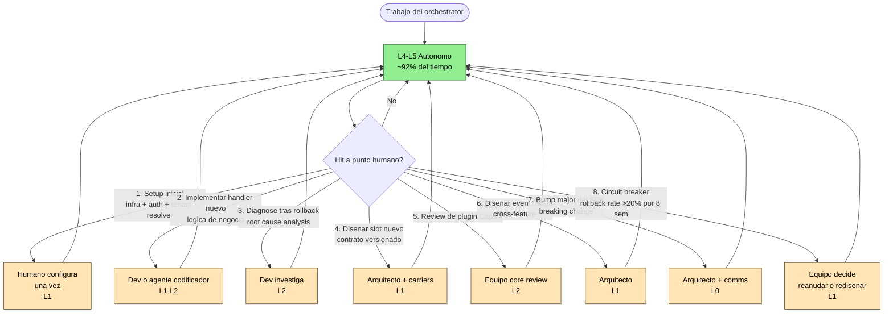

# Plan definitivo de migración — cloud_2 → microservicios + nuevo front

**Premisa:** cloud_2 es un monolito PHP de 5,362 módulos, 31,576 funciones, 2,357 clases, 1,402 tablas (880 + 522), 92 endpoints públicos, con 10 versiones paralelas del API (v1.0–v1.9, ws_lc, ws_crs_xml) y un god class de 21,488 LOC en `includes/departure_control_controller.class.php`. La customización por carrier/UAT hoy se hace forkeando archivos en `view_template_custom/`, lo que ha causado divergencia silenciosa entre tenants.

Este plan migra back y front a la vez, con el orchestrator iterativo per-feature como motor, y rediseña la arquitectura del nuevo sistema para que **agregar features custom por UAT no vuelva a requerir forks de código**.

---

## 1. Principios rectores (no negociables)

### Backend
1. **Una transición por feature, no tres por monolito.** Cada feature pasa de `legacy handler` a `api handler` en una sola operación atómica (handler_flip). Sin shared DB intermedia, sin CDC, sin fase 2/fase 3.
2. **Verificación multi-signal o no se promueve.** El compositor (`verifiers/compositor.py`) debe aprobar contract + DOM + visual + behavior + perf + concurrency. Ningún flip se acepta con "validado" verbal.
3. **Rollback instantáneo siempre disponible.** El handler legacy se conserva intacto hasta que la feature acumule N días de tráfico real sin regresión. No se borra código legacy en la misma iteración del flip.
4. **Descubrimiento por código, no por documento.** Las business rules, el side-effect map y los call paths se obtienen vía MCP/graphify sobre el código real. La documentación humana se usa como hint, no como autoridad.
5. **Sin diseño upfront de sagas, eventos ni schemas globales.** Cada feature define su contrato local. Sagas y eventos emergen solo si dos features migradas necesitan coordinarse — y se diseñan en ese momento, no antes.

### Frontend / customización
6. **Cero `if carrier === X` en código del core.** Bloqueante en code review. Si necesitas comportamiento por carrier, usa una de las 5 capas de customización.
7. **Cero copia de archivo completo para customizar.** El antipatrón `view_template_custom/foo.php` no se replica.
8. **Multi-tenancy es ciudadano de primera clase.** `tenant_id` se propaga en todas las capas (HTTP middleware → component context → API calls → logs/métricas → tests).
9. **Una pantalla puede estar migrada para N carriers y aún en legacy para M.** Routing decide por carrier × pantalla. Coexistencia es la norma durante la migración.

---

## 2. Estado actual validado (lo que sabemos del monolito)

Datos verificados contra `https://github.com/inkaviation/cloud_2`:

| Métrica                            | Valor               |
|------------------------------------|---------------------|
| Módulos PHP indexados              | 5,362               |
| Funciones                          | 31,576              |
| Clases                             | 2,357               |
| Tablas en webdcs                   | 880                 |
| Tablas en webdcs_lc                | 522                 |
| Endpoints API públicos             | 92 (Ink API 1.0.0)  |
| Versiones paralelas del ws_class   | **12** (v1, v1.1 … v1.9 = 10 numerados + ws_lc + ws_crs_xml) |
| God class principal (LOC)          | `departure_control_controller.class.php` — 21,488 LOC, 312 nodos en grafo |
| **God node real (degree)**         | **`.row()` deg=16,611** (clase base ORM) — verdadero hub del monolito |
| Pares de archivos con >10K calls compartidas | 20 (copy-paste estructural masivo) |
| Funciones distintas para `block_seats` | 16 nodos en 7 archivos (más concentrado de lo asumido) |
| Clases `*_apis.class.php`          | **96** (regulación por país + integración CRS — eje mezclado) |
| Archivos en `view_template_custom/` | **512** (vs 30 en `view_template_standard/`) — solo 2 son overrides reales |
| Communities Leiden (graphify)      | 4,402 total; 78 con >100 nodos; 22 con >500 — **sin bounded contexts naturales** |

**Anti-patrones inherentes a evitar:**
- Forks de archivo completo por API version (`ws_v1.X/ws_class.class.php`) y por carrier (`view_template_custom/`)
- God class con responsabilidades transversales (departure_control_controller)
- Lack of transactional integrity (INSERTs independientes sin BEGIN/COMMIT)
- Race conditions documentadas en seat assignment
- Dependencias visuales fuera del AST: HTML embebido en strings PHP, includes dinámicos, traducciones y message_templates en DB, assets referenciados por nombre construido en runtime

---

## 3. Pre-work obligatorio

Esto debe estar funcionando **antes** del primer flip productivo:

### Backend

**3.1 Inventario de duplicación de la API**
Las 10 copias paralelas significan que migrar un endpoint = migrar 10 variantes.
- Acción: correr `find_similar_code` por feature y agrupar variantes en *version clusters*
- Output: matriz `feature → [version_files]` que el orchestrator lee al planear
- Implementación: extender `code_analyzer.graph_hints` con campo `api_version_clusters`

**3.2 Snapshot de baseline production-grade (API)**
Sin baseline grabado, el verifier no tiene contra qué comparar.
- Acción: capturar request/response/timing sobre los 92 endpoints en sandbox/staging
- Criterio: cada endpoint tiene N≥10 capturas (happy path + error + edge) firmadas con hash
- Output: `golden/api/<endpoint>.json`

**3.3 Matriz tabla → feature**
Bottom-up: ¿qué tablas toca cada feature?
- Acción: por cada endpoint, ejecutar `trace_call_path` + `side_effect_map`
- Output: `feature_table_ownership.json` — `{ "GET_block_seats": ["seat_allocations", "flights", ...] }`
- Implicación: dos features que escriben la misma tabla son candidatas a co-migrarse o quedan bloqueadas hasta diseñar ownership

**3.4 Risk classifier afinado con evidencia real**
Reemplazar heurísticas por señales medibles:
- `god_nodes` de graphify (ya integrado)
- LOC de archivos involucrados (penalizar >5K)
- Número de variantes API (penalizar >3)
- Toca `departure_control_controller.class.php` → `risk:critical` automático
- Side effects en >10 tablas → `risk:high` automático

**3.5 Contract testing real, no markdown**
Los 92 endpoints como `.md` no son ejecutables.
- Acción: convertir a OpenAPI 3.0 (la API ya está indexada, api_id `7105b76f8c3d`)
- Output: `openapi/cloud_2.yaml` que alimenta `golden_diff` y contract tests

### Frontend

**3.6 View Crawler (asset & reference discovery)**
Una herramienta que renderiza cada pantalla en headless con sesión válida y captura **todo lo invisible al AST**:
1. Todos los assets cargados (HTML, CSS, JS, imágenes, fonts, AJAX) — `Page.loadingFinished` events
2. DOM completo + AX tree
3. Screenshot a 3 viewports (desktop/tablet/mobile)
4. Persistir `golden/views/<screen>/<carrier>/<state>.json`

Sin esta matriz `pantalla × carrier × estado → fingerprint completo` no hay baseline contra qué medir.

**3.7 Translation/Message template extractor**
Strings y plantillas viven en DB.
- Dump de `translations`, `message_templates`, `email_templates` por `carrier_key`
- Cross-reference con grep de código + JS rendered
- Output: `translations_per_carrier.json`

**3.8 Static asset inventory**
- Walk recursivo: `*.png|jpg|svg|gif|woff|css` en `view_template_*`
- Hash + size + dimensiones
- Cross-reference con captures del View Crawler para identificar **huérfanos** (no usados) y **referenciados pero faltantes** (404s esperando)
- Output: `asset_manifest.json` con `used_by_carrier[]`

**3.9 Customization inventory**
Diff automático `view_template_standard/` vs `view_template_custom/`:
- Qué archivos están duplicados, qué % difieren
- Qué carriers usan qué overrides (lookup en config/DB)
- Output: `customization_inventory.csv`
- **Esta lista es el universo a refactorizar.** Cada item termina como (a) configuración, (b) plugin, o (c) borrado si está stale.

### Infraestructura compartida

**3.10 Routing/proxy layer**
- Nginx / Cloudflare workers que decida per-route si va a legacy PHP o nuevo handler/front
- Switching por (carrier, ruta, %tráfico)

**3.11 Session/cookie compatibility**
- El nuevo front debe leer la sesión PHP existente durante coexistencia
- Cookies, login flow, CSRF tokens compatibles

**3.12 Tenant resolution unificado**
- La misma lógica que asocia user→carrier funciona idéntica en legacy y nuevo
- Single source of truth para `tenant_id`

---

## 4. Arquitectura del nuevo sistema

### 4.1 Backend — microservicios per-feature, no per-domain upfront

- Sin diseño global de bounded contexts a priori
- Cada feature migrada vive en `core_dcs` (o repositorio análogo) como handler nuevo
- Los servicios emergen agrupando features que comparten ownership de tablas
- Tecnología: TypeScript por defecto (consistencia con orchestrator), pero queda abierto a Go/Python si una feature lo justifica con datos
- Eventos / sagas / EventBridge: **no se diseñan hasta que dos features migradas necesiten coordinarse**. Diseño just-in-time

### 4.2 Frontend — 5 capas de customización por costo

```
Capa 0 — Config-as-data       ← 60% de los pedidos terminan aquí
Capa 1 — Theme tokens          ← 15%
Capa 2 — Feature flags         ← 10%
Capa 3 — Component slots       ← 10%
Capa 4 — Plugin de código      ← 5% (último recurso)
```

**Regla:** un pedido de carrier solo sube de capa si la inferior es genuinamente insuficiente. Code review rechaza Capa 4 cuando cabe en Capa 0.

#### Capa 0 — Config-as-data
Todo lo que es **datos** vive en config JSON/YAML por carrier:
- Campos visibles en formularios + orden + grupos
- Validaciones (regex, min/max, required)
- Copy de botones, labels, mensajes
- Currency, date format, timezone
- IATA codes aceptados
- Workflow steps habilitados (pasos opcionales en check-in/boarding)

Storage: tabla `carrier_config` con JSON validado contra schema. Versionado, auditado, sin redespliegues.

#### Capa 1 — Theme tokens
- Logo, colores, fonts, espaciados, bordes — todo expresado en tokens CSS
- Cada carrier tiene un `theme.json` que se compila a CSS variables
- Un componente, muchos themes — nunca componentes forkeados

#### Capa 2 — Feature flags
- "Carrier A activa pre-boarding lounge", "Carrier B desactiva infant validation"
- Flags evaluados en runtime con carrier como contexto
- Default seguro siempre (off)
- Lifecycle documentado (sunset date al crearlo)

#### Capa 3 — Component slots
Cada pantalla expone "slots" extensibles:

```tsx
<CheckInScreen>
  <Slot name="passenger-header.before" />
  <PassengerHeader />
  <Slot name="passenger-header.after" />
  <SeatPicker />
  <Slot name="seat-picker.action-buttons" />
</CheckInScreen>
```

El carrier registra qué componente va en qué slot vía config. **Los slots son contrato versionado** — agregar/remover requiere bump major.

#### Capa 4 — Plugin de código
Solo para business logic genuinamente único que no cabe en las capas anteriores:
- Vive en su propio paquete `@dcs/carrier-XYZ-extensions`
- Acceso al core solo vía API pública estable (SDK)
- Tests propios obligatorios para builds
- Reviewable por equipo core
- Carrier A roto no toca carrier B

### 4.3 Multi-tenancy de primera clase

Cada layer del stack propaga `tenant_id`:
- HTTP middleware lo inyecta desde subdomain/header
- Component context lo expone (`useTenant()`)
- API calls lo agregan automáticamente
- Logs y métricas lo etiquetan
- Tests lo parametrizan

### 4.4 SDK público estable

Para que las extensions de Capa 4 no se rompan en cada release:
- API pública versionada semánticamente
- Solo se exportan tipos/funciones marcados `@public`
- `@internal` no es accesible desde paquetes externos (enforced por linter)
- Breaking changes solo en major bump, con 2 sprints de aviso a carriers afectados

### 4.5 Ownership

- Cada pantalla tiene un `OWNERS` con (1) team del core, (2) representantes de carriers que la usan
- CI corre matrix por carrier — un cambio que rompe a *cualquier* carrier es rojo
- El equipo core puede hacer breaking changes pero coordina deprecations con carriers afectados

---

## 5. Estrategia de migración (secuenciación)

### 5.1 Backend — tiers basados en señales del código

#### Tier B0 — Pilots (semanas 1–4)
Features que cumplen TODAS:
- ≤3 variantes API (poco copy-paste)
- ≤5 tablas tocadas
- 100% read-only (sin INSERT/UPDATE/DELETE)
- BR claras (≤10 reglas documentables)

**Excepción autorizada:** `GET /api/1.8/flight/block_seats` aunque es write — ver pilot en sección 8.

#### Tier B1 — Read-only de baja entropía (mes 2–3)
Features que solo leen y tocan ≤3 tablas: lookups de carriers, stations, configuration, reference data. Validan el pipeline end-to-end con bajo blast radius.

#### Tier B2 — Writes con ownership claro (mes 4–6)
Features cuyo `feature_table_ownership.json` muestra que **ninguna otra feature no-migrada** escribe sus tablas. Migran sin coordinación cross-service.

#### Tier B3 — Writes que comparten tablas (mes 7+)
Recién aquí aparece el diseño de eventos/sagas — y solo entre features ya migradas que necesitan coordinarse. Just-in-time.

#### Indefinido (no se migra hasta nuevo aviso)
- `departure_control_controller.class.php` (21K LOC) — no se toca como bloque. Se desensambla extrayendo features individuales que lo invocan.
- Las 575 tablas marcadas como deprecated — se eliminan del scope hasta que el orchestrator confirme que ninguna feature activa las toca.

### 5.2 Frontend — tiers basados en complejidad de customización

#### Tier F0 — Pantallas idempotentes y read-only (mes 1–2)
- Listados sin filtros complejos, dashboards
- Read-only, baja interacción
- Pocos overrides según `customization_inventory.csv`

#### Tier F1 — Formularios sencillos (mes 3–4)
- Edición de un solo registro, validaciones simples
- Cubren los carriers con distintos overrides para validar la matriz de capas

#### Tier F2 — Wizards multi-step (mes 5–7)
- Check-in flow, seat selection, baggage drop
- **Aquí se gana o se pierde la migración:** si los slots y feature flags soportan la diversidad real de carriers, escalas; si no, se reestudia la arquitectura antes de seguir

#### Tier F3 — Pantallas operacionales críticas (mes 8+)
- Departure control, load control, boarding gate
- Migran solo cuando el resto está estable y los carriers más exigentes ya validaron Tier F2

---

## 6. Framework de verificación

### 6.1 Verifier 6/6 (Backend / API)

| Señal       | Tool                  | Umbral pass                                      |
|-------------|----------------------|--------------------------------------------------|
| Contract    | OpenAPI diff         | 0 breaking changes                               |
| DOM         | DOM hash + similarity| similarity ≥ 0.99                                |
| Visual      | pixel diff           | <0.5% pixels diferentes                          |
| Behavior    | replay traffic       | response equality 100% en N=1000 captures        |
| Perf        | latency p99          | p99_new ≤ p99_legacy × 1.10                      |
| Concurrency | parallel captures    | 0 race conditions detectadas en N=100 runs       |

**Regla:** 6/6 verde = promote. Cualquier rojo = rollback automático y feature queda en quarantine para análisis humano.

### 6.2 Verifier 8/8 por carrier (Frontend)

| Señal              | Tool                     | Umbral pass                                              |
|--------------------|--------------------------|----------------------------------------------------------|
| DOM structure      | jsdom diff               | similarity ≥ 0.99 (test IDs preservados al 100%)         |
| Visual regression  | pixel diff per viewport  | <0.5% pixels diff en 3 viewports × N carriers            |
| Accessibility      | axe-core                 | 0 violations new (no regression de baseline)             |
| i18n completeness  | string scan              | 0 untranslated keys por carrier activo                   |
| Asset integrity    | network log              | 0 4xx/5xx en assets cargados                             |
| Behavior           | Playwright user flow     | 100% pass de happy path + edge per carrier               |
| Perf               | Lighthouse               | LCP/CLS/TBT no degradan >10%                             |
| Tenancy isolation  | cross-tenant tests       | 0 leaks (pedir como carrier A no muestra nada de B)      |

**Regla front:** 8/8 verde **por carrier** = promote para ese carrier. Una pantalla puede estar migrada para 3 carriers y aún en legacy para 2.

---

## 7. Reglas no negociables (resumen consolidado)

### Backend
1. Cero "vision documents" como autoridad. El orchestrator descubre el código real vía MCP.
2. Cero refactor del monolito que no esté motivado por una feature en flip.
3. Cero migración de tablas sin que su feature owner esté migrada o en flip activo.

### Frontend / customización
4. Cero `if carrier === X` en código del core. Bloqueante en code review.
5. Cero copia de archivo completo para customizar (el antipatrón `view_template_custom/`).
6. Cero overrides "temporales": si un cambio entra como Capa 4 (plugin), tiene fecha de revisión a 6 meses para subirlo a Capa 0–3 si es generalizable.
7. Cero deuda invisible: cada customización (config, theme, flag, slot, plugin) es enumerable vía CLI: `dcs list-customizations --carrier=X`.
8. Cero divergencia silenciosa: theme/config/flags se validan contra schema en CI; un cambio del core que invalida config de carrier es rojo en su PR.
9. Cero acceso a internals desde plugins: `@internal` enforced por lint, plugins solo usan SDK público versionado.
10. Cero pantalla migrada sin matrix de tests por carrier.

### Operación
11. Cero rollback manual: el verifier dispara automáticamente al detectar regresión.
12. Cero promote sin soak de N días en producción con tráfico real.
13. Cero deprecation de handlers legacy hasta confirmar 100% del tráfico en el handler nuevo durante ≥30 días.

---

## 8. Pilots concretos

### 8.1 Pilot Backend: `GET /api/1.8/flight/block_seats`

**Por qué este endpoint es el primer flip:**
- Función localizable: `includes/ws_v1.8/ws_flight.class.php:921`
- 16 funciones relacionadas trazables (`block_seats`, `unblock_seats`, `block_seat_on_legs`, `parse_reply_block_seats`, etc.)
- 15 BR explícitas y 9 stages mapeables
- Race condition documentada → buen test del verifier en concurrencia
- Failure mode = double-booking (fácilmente detectable)
- Si funciona aquí, el patrón aplica al resto del DCS

**Pre-flip checklist:**
- [ ] OpenAPI extraído del endpoint
- [ ] Captures baseline N≥1000 desde tráfico real (sandbox/staging)
- [ ] `feature_table_ownership` extraído (esperado: `seat_allocations`, `flights`, `flight_status_changes`, `carriers`, `seats`, `company_associations`)
- [ ] Variantes a actualizar: identificar si v1.7 / v1.9 tienen el mismo endpoint y cuántos clientes los consumen
- [ ] Handler nuevo en `core_dcs` implementado y pasando los 6/6 verifiers en shadow mode
- [ ] Rollback validated: ejercer flip back-to-legacy y confirmar que no queda estado inconsistente

**Criterio de éxito:**
- 14 días en producción con tráfico real al 100%
- 0 rollbacks
- 0 race conditions detectadas
- p99 latency ≤ legacy × 1.10
- 0 tickets abiertos por usuarios

Si pasa: el pipeline está validado y se ataca Tier B1.
Si falla: se diagnostica el verifier o el handler nuevo, no se intenta otro pilot hasta resolver.

### 8.2 Pilot Frontend: pantalla de dashboard / listado read-only

**Por qué:**
- Read-only — sin mutaciones que puedan dejar estado inconsistente
- Baja customización entre carriers — bajo riesgo de descubrir gaps en Capa 0–3
- Cubre la matriz: misma pantalla × N carriers × N estados

**Criterio de éxito:**
- 14 días en producción para los carriers seleccionados
- 8/8 verde para todos
- 0 missing translations
- 0 assets faltantes (404)
- Si un carrier necesita un slot que no existe, **se diseña el slot antes de seguir** — no se forkea el archivo

---

## 9. Métricas de éxito

Cada 4 semanas, reportar:

### Backend
1. **Features migradas**: count + cumulative coverage (% del tráfico de los 92 endpoints servido por handler nuevo)
2. **Rollbacks ejecutados**: count + root cause clasificado (contract/DOM/visual/behavior/perf/concurrency)
3. **Tablas con ownership resuelto**: count / 827 activas
4. **Variantes API consolidadas**: cuántas de las 10 copias paralelas quedaron deprecated tras la migración de cada feature
5. **God class footprint**: LOC restante en `departure_control_controller.class.php` (objetivo: descender a 0 antes de mes 18)

### Frontend / customización
6. **Distribución de customizaciones por capa**: % en Capa 0 / 1 / 2 / 3 / 4
   - Objetivo: ≥75% en Capa 0–2 a los 12 meses
   - Si Capa 4 crece, los slots/flags están mal diseñados
7. **Time-to-customize**: tiempo medio de "carrier pide" → "carrier en prod"
   - Objetivo: <1 día para Capa 0, <3 días para Capa 1–3
8. **Customer-blocking changes**: cuántos cambios del core requirieron coordinación con carriers (objetivo: <2/mes)
9. **Carrier divergence**: % de diff visual entre carriers para una misma pantalla migrada
10. **Test matrix coverage**: pantallas con matrix por carrier / pantallas migradas — debe ser 100%

**Circuit breaker:** si en cualquier ventana de 8 semanas el rollback rate > 20%, **se pausa la migración** y se reevalúan umbrales del verifier o el risk classifier.

---

## 10. Cómo escala "agregar feature custom para UAT nuevo"

**Modelo actual (cloud_2):**
1. Carrier nuevo pide feature
2. Dev copia `view_template_standard/foo.php` → `view_template_custom/foo.php`
3. Modifica el copy
4. Deploy
5. 6 meses después el `standard` cambió y el `custom` quedó stale, nadie se entera hasta que rompe en prod

**Modelo nuevo:**
1. Carrier nuevo pide feature
2. Dev evalúa en orden: ¿es Capa 0? ¿Capa 1? ¿2? ¿3? ¿solo 4?
3. Si Capa 0–3: edita `carrier_config.json`, abre PR, CI corre matrix, mergea. Hot-reload o deploy mínimo.
4. Si Capa 4 (raro): scaffold con CLI: `dcs new-plugin --carrier=X --feature=Y`. Plugin nace con tests, types, manifiesto, slot binding. PR lo agrega como dependencia opcional.
5. Cuando `standard` cambia: matrix de CI corre todos los carriers, si el nuevo carrier rompe, el autor sabe **antes** de mergear, no en producción.

**Cambio cualitativo:** customizar pasa de *fork sin trazabilidad* → *PR pequeño con tests automáticos*.

---

## 11. Lo que NO se hace en este plan

- **No se diseña la arquitectura target completa antes de migrar.** Emerge.
- **No se eligen tecnologías per-servicio antes de tener 3 features migradas.**
- **No se promete un timeline de 12 meses.** El throughput es features/semana, y se mide post-pilot.
- **No se construyen sagas, EventBridge ni Schema Registry hasta que dos features migradas necesiten coordinarse.**
- **No se desploma el monolito.** Cuando todas las features estén migradas, cloud_2 queda como fallback de solo lectura por ≥6 meses antes de retirar.
- **No se promete "una vista, un carrier" en simultáneo.** Una pantalla migrada para carrier A puede coexistir con la legacy para B.
- **No se eliminan los `view_template_custom/` actuales sin reemplazo validado** en Capa 0–4.
- **No se permite a un carrier auto-publicar un plugin.** Capa 4 es review obligatorio del equipo core.
- **No se construye un "marketplace" de plugins entre carriers.** Plugins son privados; lo común se generaliza a Capa 0–3.

---

## 12. Loop ejecutable

```
# Backend
while features_pendientes:
    feature = picker.next(tier_actual_B, evidence_based_signals)
    pre_flip_checklist(feature)
    flip(feature)
    if verifier_6of6(feature) == "green":
        soak(feature, dias=14)
        if soak.passes(): mark_migrated(feature)
        else: rollback(feature); requarantine(feature)
    else:
        rollback(feature); diagnose(feature)

# Frontend (paralelo)
while pantallas_pendientes:
    pantalla = picker.next(tier_actual_F, customization_complexity)
    pre_flip(pantalla)
        view_crawler.capture_baseline(pantalla, all_carriers, all_states)
        customization_inventory.materialize(pantalla)
    for carrier in carriers_using(pantalla):
        flip(pantalla, carrier)
        if verifier_8of8(pantalla, carrier) == "green":
            soak(pantalla, carrier, dias=14)
            if soak.passes(): mark_migrated(pantalla, carrier)
            else: rollback(pantalla, carrier)
        else:
            rollback(pantalla, carrier); diagnose(pantalla, carrier)
```

El orchestrator existente implementa el loop backend. El loop frontend requiere extender el verifier con las 2 señales adicionales (a11y, i18n, asset, tenancy) y construir el View Crawler.

---

## 13. Diagramas para revisión arquitectónica

### 13.1 Arquitectura de coexistencia (estado actual → estado target)



### 13.2 Capas de customización por carrier/UAT



### 13.3 Loop de migración con gates de verificación



### 13.4 Señales de los verifiers



### 13.5 Secuenciación de tiers (back y front en paralelo)



### 13.6 Propagación del tenant_id a través del stack



### 13.7 Decisión: ¿en qué tier va una feature?



---

## 14. Niveles de autonomía y puntos de intervención humana

**Objetivo:** intervención humana mínima e irreducible. El humano solo entra cuando (a) la decisión es irreversible, (b) requiere juicio que el sistema no puede automatizar, o (c) hay una excepción que rompe los invariantes.

### 14.1 Escala de autonomía

| Nivel | Nombre        | Quién actúa                         | Quién decide                 | Notificación al humano  |
|-------|---------------|-------------------------------------|------------------------------|-------------------------|
| L0    | Manual        | Humano                              | Humano                       | N/A                     |
| L1    | Asistido      | Humano (con tooling del orchestrator) | Humano                     | N/A                     |
| L2    | Aprobado      | Sistema propone, humano aprueba c/u | Humano                       | Cada propuesta          |
| L3    | Supervisado   | Sistema actúa                       | Humano revisa periódicamente | Resumen semanal         |
| L4    | Notificado    | Sistema actúa autónomamente         | Sistema (con reglas)         | Solo en excepciones     |
| L5    | Autónomo      | Sistema actúa autónomamente         | Sistema                      | Ninguna                 |

**Default del plan: L4–L5.** L0–L2 solo donde el plan lo declara explícitamente abajo.

### 14.2 Autonomía por fase — auditoría completa del plan

| Fase / acción                                              | Nivel | Por qué                                                                 |
|------------------------------------------------------------|-------|-------------------------------------------------------------------------|
| **Pre-work**                                               |       |                                                                         |
| 3.1 Inventario duplicación API (find_similar_code)         | L5    | Determinístico, vía MCP                                                 |
| 3.2 Snapshot baseline API                                  | L5    | Captura automática contra sandbox                                       |
| 3.3 Matriz tabla→feature                                   | L5    | trace_call_path + side_effect_map vía MCP                               |
| 3.4 Risk classifier afinado                                | L5    | Heurísticas con thresholds fijos                                        |
| 3.5 Conversión a OpenAPI 3.0                               | L5    | Pull desde Ink API ya indexada                                          |
| 3.6 View Crawler                                           | L5    | Headless browser scriptado                                              |
| 3.7 Translation/template extractor                         | L5    | Dump SQL                                                                |
| 3.8 Asset inventory                                        | L5    | Walk filesystem                                                         |
| 3.9 Customization inventory                                | L5    | Diff automático de directorios                                          |
| 3.10 Setup routing/proxy                                   | **L1**| Infraestructura inicial — humano configura una vez                      |
| 3.11 Session/cookie compatibility                          | **L2**| Validación de seguridad — riesgo de session hijack                      |
| 3.12 Tenant resolution unificado                           | **L1**| Diseño inicial; después L5 para enforcement                             |
| **Loop de migración**                                      |       |                                                                         |
| Picker selecciona próxima feature/pantalla                 | L5    | Algoritmo determinista sobre señales del código                         |
| Pre-flip checklist (baseline, ownership, crawler)          | L5    | Automatizable end-to-end                                                |
| Implementación del handler nuevo                           | **L1–L2**| **Acá entra el humano (o un agente codificador supervisado)** — código real, lógica de negocio |
| Shadow mode + verifier 6/6 ó 8/8                           | L5    | Verificador determinista                                                |
| Decisión de promote                                        | L5    | Si 6/6 ó 8/8 verde → automático                                         |
| Flip atómico                                               | L5    | Operación reversible y verificable                                      |
| Soak de 14 días                                            | L5    | Monitoreo continuo                                                      |
| Mark migrated                                              | L5    | Si soak.passes() → automático                                           |
| Rollback automático                                        | L5    | Trigger por verifier rojo ó soak fallido                                |
| **Diagnose post-rollback**                                 | **L2**| Analizar root cause — humano decide si es bug del verifier o del handler nuevo |
| **Customización por carrier**                              |       |                                                                         |
| Capa 0–2 (config / theme / flags)                          | L4    | PR con CI matrix; auto-merge si verde y dueño aprueba                   |
| Capa 3 (slots existentes)                                  | L4    | Igual a Capa 0–2                                                        |
| **Diseño de un slot nuevo**                                | **L1**| Decisión arquitectónica — afecta contrato versionado                    |
| **Capa 4 (plugin de código)**                              | **L2**| Review obligatorio del equipo core                                      |
| **Decisiones arquitectónicas emergentes**                  |       |                                                                         |
| Diseño de evento/saga (cuando dos features se cruzan)      | **L1**| Diseño de contrato distribuido                                          |
| Bump major del SDK público                                 | **L0**| Decisión humana + comunicación a carriers                               |
| Pausa de migración (rollback rate >20% en 8 semanas)       | **L1**| Sistema dispara la pausa; humano analiza y decide reanudar              |
| Onboarding inicial de carrier nuevo                        | **L1**| Configuración inicial, definición de scope                              |
| Deprecation final del monolito                             | **L0**| Decisión de negocio — irreversible                                      |

### 14.3 Los 8 puntos donde el humano es irreducible

Después de la auditoría, el humano solo entra en estos 8 puntos. Todo lo demás es L4–L5.



**Frecuencia esperada por punto** (estimación post-pilot, asumiendo throughput de 2 features migradas por semana):

| # | Punto                                      | Frecuencia estimada                         |
|---|--------------------------------------------|---------------------------------------------|
| 1 | Setup inicial                              | 1 vez total                                 |
| 2 | Implementar handler nuevo                  | 2 / semana (≈ 1 feature)                   |
| 3 | Diagnose tras rollback                     | <1 / semana (target: <20% rollback rate)   |
| 4 | Diseñar slot nuevo                         | <1 / mes (decae con el tiempo)             |
| 5 | Review de plugin Capa 4                    | <1 / mes (objetivo: <5% en Capa 4)         |
| 6 | Diseñar evento/saga                        | <1 / mes (solo en Tier B3)                 |
| 7 | Bump major del SDK                         | 1–2 / año                                   |
| 8 | Circuit breaker                            | 0–1 / año (idealmente nunca)                |

**Total horas-persona estimadas/semana en estado estable:** ~20h (1 dev tiempo parcial para puntos 2–3 + arquitecto on-call para 4–6).

### 14.4 Lo que NUNCA pasa por humano (automation by design)

Estas decisiones se ejecutan sin humano por diseño explícito del plan. Si alguien intenta forzar review humano aquí, el sistema lo rechaza:

- **Selección de la próxima feature/pantalla a migrar** — el picker decide por señales
- **Aprobación de cada flip** — si pasa pre-flip checklist + verifier shadow, va
- **Rollback** — automático en cualquier rojo del verifier o soak fallido
- **Promote a producción** — automático en 6/6 ó 8/8 verde tras 14 días de soak
- **Aplicación de config/theme/flag de carrier** — PR + CI matrix; merge automático si verde
- **Hot-reload de Capa 0** — sin deploy, sin aprobación
- **Marcado de tablas deprecated como skip** — automático cuando ninguna feature activa las toca
- **Generación de captures, golden files, asset manifests** — toolchain del orchestrator
- **Etiquetado de `risk:critical` / `risk:high`** — heurísticas fijas (god class, LOC, side effects)
- **Cross-tenant isolation tests** — corren siempre en CI sin opt-in

### 14.5 Escalation paths — cuándo el sistema "pide ayuda"

El orchestrator emite señales claras cuando necesita humano. Sin polling:

| Trigger                                              | Canal                | Severidad   |
|------------------------------------------------------|----------------------|-------------|
| Verifier rojo persistente (>3 attempts en una feature) | Slack #migration     | Alta        |
| Rollback rate >20% en ventana 8 semanas              | Slack + ticket       | Crítica (pausa) |
| Feature en quarantine sin diagnose >7 días           | Slack ping al owner  | Media       |
| Plugin Capa 4 esperando review >3 días               | Slack ping al core   | Media       |
| Pedido de carrier que no cabe en Capa 0–3            | Ticket arquitectura  | Baja        |
| god class footprint no decrece en 4 semanas          | Reporte mensual      | Informativa |
| Carrier divergence >50% en pantalla migrada          | Reporte mensual      | Informativa |

### 14.6 Governance gates (revisión sin bloquear)

Para que arquitectos mantengan oversight sin frenar el loop:

- **Daily**: dashboard auto-generado con features flipped, rollbacks, soak status. Read-only, sin acción.
- **Weekly**: resumen de features migradas + pendientes en quarantine + cambios de tier.
- **Monthly**: review de métricas (sec 9) — distribución de capas, time-to-customize, divergence, god class footprint. Solo si una métrica se sale del umbral hay acción humana.
- **Quarterly**: arquitecto evalúa si el orchestrator necesita ajustes (umbrales del verifier, heurísticas del risk classifier, capas nuevas). PR al orchestrator, mergea normal.

Ningún gate es bloqueante por default — son señales para reaccionar si algo se desvía.

### 14.7 Resumen de autonomía

```
Default: L4-L5 (autonomo)
Excepciones: 8 puntos especificos, frecuencia conjunta < 1 evento humano por dia
Tiempo humano estimado en estado estable: ~20 h/semana total
Decisiones bloqueantes solo en: bump major SDK + deprecation monolito (raro)
```

El humano queda como **diseñador de excepciones y diagnosticador de fallos**, no como aprobador de operaciones rutinarias. El sistema migra solo cuando todas las señales son verdes; cuando no lo son, **se detiene y espera** en lugar de pedir aprobación para seguir.

---

## 15. Validación con grafo (graphify, 2026-04-30)

Grafo construido con `graphify update` sobre `cloud_2@a57eb9a` → 70,970 nodos / 221,371 edges / 4,402 communities Leiden / 6,830 archivos extraídos vía tree-sitter. Persistido en `workspace/graphify/cloud_2-graph.json`.

### 15.1 Confirmaciones

| Afirmación del plan                                      | Verificación con grafo                                |
|----------------------------------------------------------|-------------------------------------------------------|
| `block_seats` con 16 funciones                           | ✅ 16 nodos en 7 archivos (más concentrado de lo asumido) |
| God class `departure_control_controller`                 | ✅ 312 nodos, suma_degree=2,338                        |
| Copy-paste masivo en API versions                        | ✅ 12 variantes confirmadas (no 10)                    |
| Communities = bounded contexts upfront NO funciona       | ✅ Validado: 4,402 communities, solo 22 con >500 nodos, 2,816 singletons → no hay clusters limpios |
| Top god nodes existen y son cross-cutting                | ✅ Confirmado, ver tabla 15.3                          |

### 15.2 Refinamientos al plan basados en datos del grafo

**R1 — El verdadero god node es `.row()`, no `departure_control_controller`.**
- `.row()` tiene degree=16,611 y 13,976 cross-community edges. Es **5× más conectado** que cualquier otro nodo.
- Es la clase base ORM-like de la que heredan virtualmente todas las entidades (`flight`, `passenger`, `boarding_pass`, etc.)
- **Implicación:** cualquier feature que toque la persistencia hereda dependencias de `.row()`. El plan actual no contempla refactor de la base ORM.
- **Acción:** agregar al pre-work una sección "ORM extraction" — antes de Tier B2 (writes con ownership claro), evaluar si el handler nuevo replica el comportamiento de `.row()` o lo reemplaza con un acceso a datos limpio.

**R2 — Instanciación dinámica es punto ciego del orchestrator.**
- `departure_control_controller.class.php` aparece con **0 edges entrantes** en el grafo estático.
- Esto **no significa que no se llame** — significa que se invoca por strings (`row::get_instance("departure_control_controller", $db, $vars)`). El AST no captura referencias por string.
- **Implicación:** el `code_analyzer` y el `risk_classifier` deben ejecutar grep adicional sobre strings que coincidan con nombres de clases conocidas.
- **Acción:** agregar herramienta `dynamic_instantiation_scanner` al pre-work 3.4 que produce una lista `class_name → [callsites_dinámicos]` complementaria al grafo.

**R3 — La realidad de `view_template_custom/` es peor de lo asumido.**
- Plan asumía: customizaciones son overrides de `view_template_standard/`.
- **Realidad:** 512 archivos en custom vs 30 en standard, **solo 2 son overrides reales** (mismo nombre en ambos).
- Los otros 486 archivos en custom **no tienen contraparte en standard** — son pantallas y componentes únicos por carrier que crecieron sin mecanismo de promoción a core.
- **Implicación:** el "customization inventory" del pre-work 3.9 no es un diff bidireccional sino un **catálogo de pantallas únicas por carrier**. Cada una requiere decisión: ¿se generaliza a Capa 0–3 (estaba en realidad latente como feature común) o se mantiene como Capa 4 (genuinamente único)?
- **Acción:** reformular pre-work 3.9 — el output esperado es `unique_screens_per_carrier.csv` con clasificación inicial sugerida.

**R4 — `*_apis.class.php` mezcla dos ejes que el plan trataba como uno.**
- Plan decía: "regulación por país via inheritance es un eje legítimo".
- **Realidad:** 96 clases `*_apis.class.php`, mezcla de:
  - **País/regulación** (~70): `cuban_apis`, `danish_apis`, `france_apis`, `india_apis`, `singapore_apis`, etc.
  - **Carrier-específico** (~10): `avior_default_apis`, `bq_imp_passenger_apis`, `jet2_apis`, `rx_apis`
  - **Integración CRS** (~10): `sabre_etias_apis`, `navitaire_apis`, `navitaire_domestic_apis`, `gss_sabre_apis`, `edifly_apis`, `ppp_apis`, `ppp_email_apis`, `ppp_sabre_apis`
  - **Cross-axis** (~6): `iatci_apis`, `etias_apis`, `un_edifact_apis`, `general_apis`, `default_apis`
- **Implicación:** el eje "regulación por país" está enredado con "carrier" y "CRS". No es jerarquía limpia.
- **Acción:** en sección 4.2 (capas de customización) agregar:
  - **Capa 1.5 — Regulación geográfica:** los `*_apis` por país viven en módulos de compliance, no en el carrier_config. Son ortogonales al carrier.
  - **Plugin de integración (subtipo de Capa 4):** cuando un CRS-específico requiere comportamiento único (`sabre_etias`, `navitaire`), va a un paquete `@dcs/integration-<crs>` separado del paquete `@dcs/carrier-<X>`.

**R5 — Las 4,402 communities con baja cohesión validan el bottom-up.**
- 78 communities con >100 nodos, solo 22 con >500. **Solo 2,816 singletons (40% del total).**
- Esto significa que **no existen clusters claros** que se puedan llamar "Check-in domain" o "Boarding domain" sin arbitrariedad.
- **Implicación:** cualquier propuesta de bounded contexts upfront es ficticia. El plan ya rechaza ese approach (sección 4.1 backend), pero esto refuerza el principio.
- **Acción:** ninguna — el plan ya está alineado con esta realidad. Reportar en métricas mensuales (sección 9) como "graph cohesion metric" para detectar si se mejora con el tiempo.

**R6 — Los bridge nodes son el plan de pre-work real.**
- Top 10 bridge nodes (más cross-community edges):

| Nodo               | Cross-community edges | Categoría                          |
|--------------------|-----------------------|------------------------------------|
| `.row()`           | 13,976                | ORM base — refactor antes de B2    |
| `is_array()`       | 6,385                 | utilidad PHP — wrap en helpers     |
| `.count()`         | 4,483                 | utilidad PHP — wrap en helpers     |
| `empty()`          | 3,650                 | utilidad PHP — wrap en helpers     |
| `in_array()`       | 3,427                 | utilidad PHP — wrap en helpers     |
| `.translate()`     | 2,826                 | i18n — extraer a servicio          |
| `array_count()`    | 2,354                 | utilidad PHP — wrap en helpers     |
| `trim()`           | 1,765                 | utilidad PHP — wrap en helpers     |
| `station`          | 1,507                 | dominio — entidad core             |
| `.date()`          | 1,247                 | utilidad PHP — wrap en helpers     |

- **Implicación:** dos categorías de bridges:
  - **Utilidades PHP** (alta concentración) — wrap en módulo `legacy_helpers` para que el handler nuevo no replique built-ins
  - **Entidades de dominio** (`station`, `carrier`, `flight`) — son los aggregates reales del negocio. Un servicio de "FlightOps" emerge naturalmente alrededor de ellos
- **Acción:** agregar pre-work 3.13 — "Bridge node analysis": producir lista de bridges, clasificarlos en (utility / domain / antipattern) y crear módulo `legacy_helpers` antes del primer flip.

### 15.3 Top god nodes — alimentan risk_classifier directamente

```
deg=16,611  .row()            comm=1   ← ORM base (verdadero god class)
deg= 9,707  is_array()        comm=0   ← utility
deg= 7,377  .count()          comm=0   ← utility
deg= 4,791  .translate()      comm=0   ← i18n
deg= 4,187  empty()           comm=5   ← utility
deg= 3,769  in_array()        comm=7   ← utility
deg= 3,014  array_count()     comm=2   ← utility (Ink-specific helper)
deg= 2,961  station           comm=0   ← entidad de dominio
deg= 2,735  .date()           comm=0   ← utility
deg= 2,204  trim()            comm=5   ← utility
deg= 1,844  carrier           comm=0   ← entidad de dominio (multi-tenancy ya existe via carrier!)
deg= 1,722  flight()          comm=0   ← entidad de dominio
deg= 1,517  .strtoupper()     comm=0   ← utility
deg= 1,490  dcs               comm=9   ← contexto principal
deg= 1,331  .str_replace()    comm=0   ← utility
deg= 1,312  .substr()         comm=0   ← utility
deg= 1,246  .strlen()         comm=0   ← utility
deg= 1,092  business_rule     comm=3   ← módulo de BR transversal
deg= 1,077  this_server       comm=6   ← server abstraction
deg=   976  company_association comm=0 ← multi-tenancy actual
```

**Reglas automáticas para `risk_classifier`:**
- Feature toca `.row()` directamente → `risk:critical` + bloquea hasta R1 resuelto
- Feature toca >3 utilities con degree >2,000 → `risk:high` (impacta amplio)
- Feature toca `business_rule` → `risk:high` (BR transversal)
- Feature toca `company_association` → `risk:high` (multi-tenancy crítico)
- Feature toca `station`/`carrier`/`flight` → expected (es el dominio), no penaliza por sí solo

### 15.4 Pre-work 3.13 — Bridge node analysis (nuevo, derivado del grafo)

Acción:
1. Extraer top-50 bridges del grafo (cross-community edges >500)
2. Clasificar cada bridge en: `utility` / `domain_entity` / `antipattern` / `cross_cutting_concern`
3. Para `utility`: crear `legacy_helpers/` en core_dcs con wrappers tipados que repliquen el comportamiento. Permite que el handler nuevo no dependa de PHP built-ins.
4. Para `domain_entity`: documentar como aggregate root candidato. Reservado para Tier B2.
5. Para `cross_cutting_concern` (i18n, business_rule, this_server): agregar a infrastructure layer del nuevo back con interfaces estables.

Output: `bridge_classification.json` consumido por `risk_classifier` y `code_analyzer`.

### 15.5 Métricas adicionales (sección 9 extendidas)

A las 10 métricas del plan, agregar 3 derivadas del grafo:

11. **Graph cohesion**: ratio de edges intra-community / cross-community → debe **aumentar** con el tiempo (mejor encapsulación)
12. **Bridge node degree decay**: degree de los top-10 bridges en cada release → debe **decrecer** (utilities aisladas, dominio refactorizado)
13. **`.row()` reach**: cuántas features migradas siguen heredando de `.row()` directamente → debe **decrecer** hacia 0

### 15.6 Veredicto post-validación

El plan_definitivo es **estructuralmente sólido**. La validación con grafo:

- ✅ Confirma 4 de las 5 afirmaciones cuantitativas centrales
- ✅ Confirma que bottom-up por feature es la única ruta (sin bounded contexts naturales)
- ✅ Confirma que god classes existen, pero descubre que el verdadero hub es `.row()`, no `departure_control_controller`
- ⚠️ Refina 5 puntos: ORM extraction como pre-work, instanciación dinámica blind spot, realidad de view_template_custom, mezcla de ejes en *_apis, bridge nodes como categoría
- ➕ Agrega 1 pre-work nuevo (3.13 bridge analysis), 3 métricas (11-13), y reglas automáticas para risk_classifier

Las correcciones se incorporaron a la sección 2 (estado actual). Los refinamientos R1–R6 quedan documentados aquí como ajustes operacionales que el orchestrator debe absorber antes del primer flip productivo.

---

## 16. Resumen ejecutivo

**Plan definitivo = orchestrator iterativo per-feature + 13 pre-works (5 back, 4 front, 3 infra, 1 bridge analysis) + arquitectura nueva con 5 capas de customización + verifier 6/6 (back) y 8/8 por carrier (front) + pilots concretos + 13 reglas no negociables + autonomía L4–L5 con 8 puntos humanos.**

Validado con grafo (graphify): 70,970 nodos / 221,371 edges / 4,402 communities. Hallazgos clave incorporados — `.row()` es el verdadero god node (deg=16,611), instanciación dinámica es punto ciego, `view_template_custom/` no son overrides sino pantallas únicas, `*_apis` mezcla 3 ejes (país/carrier/CRS).

La migración termina cuando:
- Los 92 endpoints están servidos por handlers nuevos durante ≥30 días con 0 rollbacks
- Las pantallas operacionales están en el nuevo front para todos los carriers activos
- ≥75% de las customizaciones viven en Capa 0–2
- El god class `departure_control_controller.class.php` tiene 0 LOC y `.row()` reach decae hacia 0
- Graph cohesion (intra/cross community ratio) aumenta consistentemente

Hasta entonces, cloud_2 sigue corriendo como fallback. El orchestrator descubre la realidad iterativamente y es resiliente a errores en cualquier prior — el grafo de graphify alimenta directamente el `risk_classifier` y el `code_analyzer` para que el descubrimiento sea data-driven, no heurístico.
